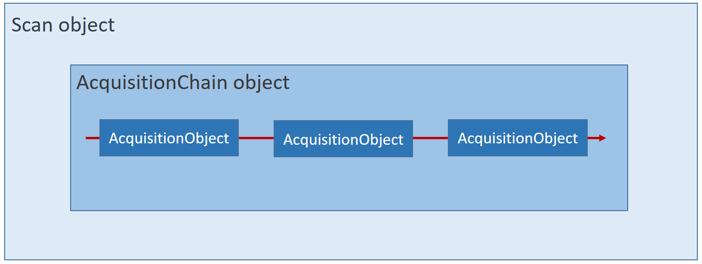
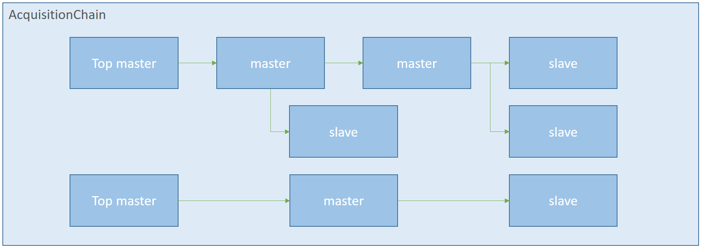
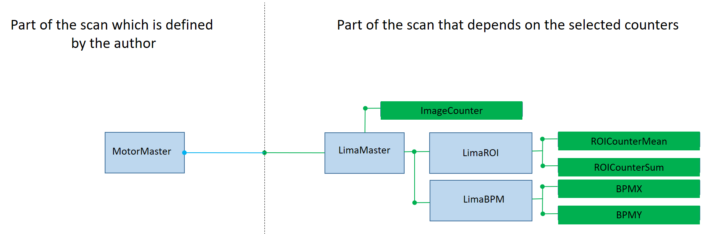
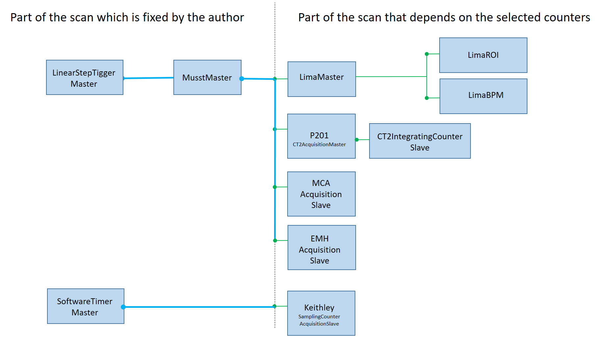

#Writing a custom scan

This section will present the fundamental concepts and objects that are involved in the context of a scan procedure.
Then it will describe how to write your own scan procedure through examples. 

###The acquisition chain
In Bliss, a scanning procedure is managed by the `Scan` object (`bliss.scanning.scan`).
The scan object works on an `AcquisitionChain` object which contains `AcquisitionObject` objects (`bliss.scanning.chain`).



The acquisition chain is a tree of acquisition objects organized in a masters and slaves hierarchy.
There are two kind of objects build on top of the `AcquisitionObject` base class, the `AcquisitionMaster` and the `AcquisitionSlave` objects.
The `AcquisitionMaster` is able to trigger the acquisition slaves below itself.
The `AcquisitionSlave` is always at the end of a branch of the acquisition chain.
The role of the `AcquisitionObject` is to encapsulate a `CounterController` in order to use it in the context of a scan.
The `AcquisitionObject` will define how to behave while receiving incoming triggers (software and/or hardware) and how to acquire and publish data.
The underlying `CounterController` is the one who knows how to read the data from the hardware device. 





The acquisition chain can be conceptually split in two regions. 
On the left, the static part containing the top level masters. This part must be entirely described by the author of the scan procedure. 
On the right, the dynamic part which depends on the list of counters given to this scan procedure. The construction of this part will be partially managed by the `ChainBuilder` object. From the given list of counters, the `ChainBuilder` object will find the `CounterController` on top of each counter.
All counter controllers are able to return the special `AcquisitionObject` associated with themselves (see `CounterController.get_acquisition_object()`).
Also, if a counter controller as a master controller on top of it, the chain builder will find it and register the links (like LimaMaster on top of LimaRoi and LimaBPM in the figure below).




###A simple scan example
Below, an example of a scan procedure which performs a step scan on one axis.
To make it simple, in this scan we will only handle Lima controllers and associated counters.

```python
def scan_demo( motor, start, stop, npoints, count_time, *counters ):

    #----- Initialize the chain object -------------------------------
    chain = AcquisitionChain()

    #----- write the 'left side' of the chain
    # the MotorMaster
    acq_master = LinearStepTriggerMaster(npoints, motor, start, stop)

    
    #----- write the 'right side' of the chain
    builder = ChainBuilder(counters)

    #----- handle possible controllers introduced by the counters 
    #----- here we will only handle the Lima controllers 
    #----- and associated counters such as Images, Rois and BPMs -----
    lima_params = {
        "acq_nb_frames": npoints,
        "acq_expo_time": count_time * 0.9,
        "acq_trigger_mode": "INTERNAL_TRIGGER_MULTI",
        "prepare_once": True,
        "start_once": False,
    }

    for node in builder.get_nodes_by_controller_type(Lima):
        # setting the parameters of the LimaMaster is enough 
        # the children slaves under the LimaMaster will try to find 
        # their parameters from the LimaMaster parameters
        node.set_parameters(acq_params=lima_params) 

        # adding the LimaMaster to chain is enough 
        # the children slaves (ROI, BPM) are automatically placed below
        # their master
        chain.add(acq_master, node)                 

    #----- print some information about the chain construction --------
    #print the result of the introspection
    builder.print_tree(not_ready_only=False)
    #print the chain that has been built
    print(chain._tree)

    #----- finalize the scan construction ----------------------------
    scan_info = {
        "npoints": npoints,
        "count_time": count_time,
        "start": start,
        "stop": stop,
        "type": "continous_scan_demo",
    }

    sc = Scan(
        chain,
        name="scan_demo",
        scan_info=scan_info,
        #save=False,
        #save_images=False,
        #scan_saving=None,
        #data_watch_callback=StepScanDataWatch(),
    )

    #----- start the scan ----------------------------
    sc.run()
```


####The static part of the scan definition ('left side')
In the first part, we instantiate the chain object and the motor top master.
The motor top master (`LinearStepTriggerMaster`) will perform `npoints` steps from `start` position to `stop` position.
As a top master, it will be the first in the chain (root) and it will be the one who triggers all other acquisition objects that are placed under him.
We do not put it in the chain right now because it will be done a bit later on when adding other acquisition objects in the chain under this one.

```python
def scan_demo( motor, start, stop, npoints, count_time, *counters ):

    #----- Initialize the chain object -------------------------------
    chain = AcquisitionChain()

    #----- write the 'left side' of the chain
    # the MotorMaster
    acq_master = LinearStepTriggerMaster(npoints, motor, start, stop)

```


####The dynamic part of the scan definition ('right side')
In the second part, we instantiate the chain builder object with the list of counters given to that scan (`ChainBuilder(counters)`).
Notice that, at that time, `counters` may contains different objects of different types such as `Counter`, `CounterController`, `MeasurementGroup`.   

```python
    builder = ChainBuilder(counters)
```

During its initialization, the chain builder will:

- obtain a flatten list of `Counters` by retrieving counters from `CounterControllers` and `MeasurementGroups`.
- remove duplicated counters and sort the counters by name.
- sort the counters by dependency level (for example `CalcCounters` are stored at the end of the counter list because they depend on others real counters).
- introspect the counter list in order to find the `CounterControllers` on top of the different counters and create one `ChainNode` object per `CounterController`.
- check if the `CounterControllers` have a `master_controller` on top of them. If true a `ChainNode` object is created for the `master_controller` and the node registers the `CounterControllers` that are attached to itself (see `node.children`). Notice that a `master_controller` is an instance of a `CounterController`.


After this, the builder has created a dictionary of `ChainNodes` (one per `CounterController`) (see `builder.nodes`). The role of the `ChainNode` object is to store the information required to instantiate the `AcquisitionObject` associated to each `CounterController`.


####Handle the counters of a given type of CounterController (example with Lima)
Once the builder is initialized, we must define the acquisition parameters that will be used for each `AcquisitionObject` associated to each `CounterController`.
To do so, we ask to the builder to return all nodes that hold a `CounterController` of a given type. In this example we want the nodes of Lima controllers (`builder.get_nodes_by_controller_type(Lima)`). Then we declare the lima acquisition parameters and store them into the node (`node.set_parameters(acq_params=lima_params)`).

```python
    #----- handle possible controllers introduced by the counters 
    #----- here we will only handle the Lima controllers 
    #----- and associated counters such as Images, Rois and BPMs -----
    lima_params = {
        "acq_nb_frames": npoints,
        "acq_expo_time": count_time * 0.9,
        "acq_trigger_mode": "INTERNAL_TRIGGER_MULTI",
        "prepare_once": True,
        "start_once": False,
    }

    for node in builder.get_nodes_by_controller_type(Lima):
        # setting the parameters of the LimaMaster is enough 
        # the children slaves under the LimaMaster will try to find 
        # their parameters from the LimaMaster parameters
        node.set_parameters(acq_params=lima_params) 
```

The last thing we must do with this Lima node is to define where to put it in the acquisition chain.
In this example we have decided to put it under the `LinearStepTriggerMaster` (`chain.add(acq_master, node)`).
It means that it will be the `LinearStepTriggerMaster` who triggers the `LimaAcquisitionMaster` and then the `LimaAcquisitionMaster` will trigger the slaves under itself.

```python
        # adding the LimaMaster to chain is enough 
        # the children slaves (ROI, BPM) are automatically placed below
        # their master
        chain.add(acq_master, node)   
```

The `LimaAcquisitionMaster` associated to that node is created only at that time (wen putting it into the chain).
The `LimaAcquisitionMaster` is instantiated using the acquisition parameters that have been stored into the node (see `node.acquisition_parameters`).
If this node has children nodes (example LimaRoi and LimaBPM), the `AcquisitionObject` of each child node will be instantiated at this time and placed in the chain below the AcquisitionObject of this node. If the acquisition parameters of the children nodes have not been set, the children nodes will try to find their parameters in the parent parameters. 


####Setting the children nodes parameters explicitly
In the case where we want to set the children parameters explicitly we could have done like this:
```python
    
    lima_params = {
        "acq_nb_frames": npoints,
        "acq_expo_time": count_time * 0.9,
        "acq_trigger_mode": "INTERNAL_TRIGGER_MULTI",
        "prepare_once": True,
        "start_once": False,
    }

    lima_children_params = {"count_time": count_time * 0.8, "npoints": npoints }

    for node in builder.get_nodes_by_controller_type(Lima):
    
        node.set_parameters(acq_params=lima_params) 

        for child_node in node.children:
            child_node.set_parameters(acq_params=lima_children_params)

```

Now, we have handle the possible counters related to the Lima controller.


####Handle other type of devices

If we wanted to handle other type of controllers/counters we would have to repeat what has been done above:

```python
    
    xxx_params = {
        "abc": ... ,
        "foo": ... }

    for node in builder.get_nodes_by_controller_type( xxx ):

        node.set_parameters(acq_params=xxx_params) 
```


####Check what you have done
In order to check if all the ChainNodes of the builder have been managed properly, you can use `builder.print_tree()` to show/print the tree representation of the chain nodes. If the argument `not_ready_only` is True, it will be printed only if some nodes have not been treated. 
In order to check if the chain has been built properly and looks as expected, you can use `print(chain._tree)` to show/print the tree representation of the acquisition chain.

```python
    #----- print some information about the chain construction --------
    #print the result of the introspection (ChainNodes of the builder)
    builder.print_tree(not_ready_only=False)
    #print the chain that has been built (AcquisitionChain as a tree)
    print(chain._tree)
```


####Finalize and run your scan
To finalize the writing of the scan procedure, you have to create the `Scan` object passing the `chain` and the `scan_info`.
The `scan_info` is a dictionary containing the information you want to expose to the outer world. 
Finally, start the scan by calling its `run()` method.

```python
    #----- finalize the scan construction ----------------------------
    scan_info = {
        "npoints": npoints,
        "count_time": count_time,
        "start": start,
        "stop": stop,
        "type": "continous_scan_demo",
    }

    sc = Scan(
        chain,
        name="scan_demo",
        scan_info=scan_info,
        #save=False,
        #save_images=False,
        #scan_saving=None,
        #data_watch_callback=StepScanDataWatch(),
    )

    #----- start the scan ----------------------------
    sc.run()
```

###A more complex scan example

