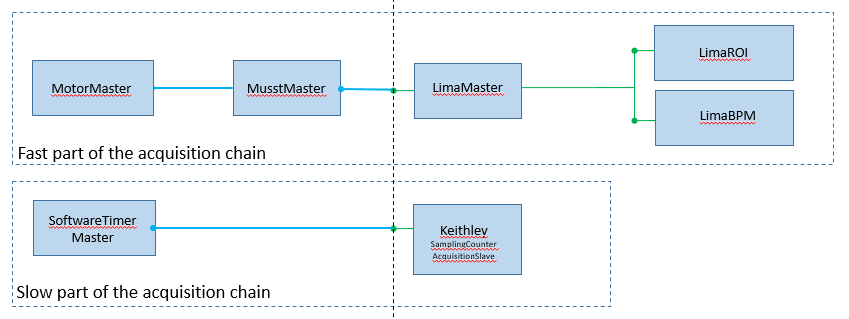

# Writing a custom scan

This section presents the fundamental concepts and objects involved in a scan
procedure. Then it will describe how to write your own scan through examples.

### The acquisition chain

In Bliss, a scanning procedure is managed by the `Scan` object
(from `bliss.scanning.scan`).

The `Scan` object works on top of an `AcquisitionChain` object containing
`AcquisitionObject` objects (from `bliss.scanning.chain`).


The acquisition chain is a *tree of acquisition objects* organized in a
*masters* and *slaves* hierarchy.


There are two kind of objects built on top of the `AcquisitionObject` base
class: `AcquisitionMaster` and `AcquisitionSlave` (from `bliss.scanning.chain`).

* The `AcquisitionMaster` is able to trigger the acquisition slaves below itself.
* The `AcquisitionSlave` is always at the end of a branch of the acquisition chain.

The role of the `AcquisitionObject` is to encapsulate a `CounterController` in order to
use it in the context of a scan.

The `AcquisitionObject` defines how to behave while receiving incoming triggers
(software and/or hardware) and how to acquire and publish data.

The underlying `CounterController` is the one who knows how to read the data
from the hardware device.

The acquisition chain can be conceptually split in two regions.


On the left, the static part containing the top level masters. This part must be
entirely described by the author of the scan procedure.

On the right, the dynamic part which depends on the list of counters given to
this scan procedure. The construction of this part will be partially managed by
the `ChainBuilder` object. From the given list of counters, the `ChainBuilder`
object will find the `CounterController` on top of each counter.

All counter controllers are able to return the special `AcquisitionObject`
associated with themselves (see `CounterController.get_acquisition_object()`).

Also, if a counter controller has a master controller on top of it, the chain
builder will find it and register the links (like *LimaMaster* on top of *LimaRoi*
and *LimaBPM* in the figure above).


### A simple scan example

Below, an example of a scan procedure which performs a step scan on one axis.

To make it simple, this scan will only handle Lima controllers and
associated counters.

```python
def scan_demo( motor, start, stop, npoints, count_time, *counters ):

    #----- Initialize the chain object -------------------------------
    chain = AcquisitionChain()

    #----- write the 'left side' of the chain
    # the MotorMaster
    acq_master = LinearStepTriggerMaster(npoints, motor, start, stop)


    #----- write the 'right side' of the chain
    builder = ChainBuilder(counters)

    #----- handle possible controllers introduced by the counters
    
    #----- handles the Lima controllers
    #----- and associated counters such as Images, Rois and BPMs -----
    lima_params = {
        "acq_nb_frames": npoints,
        "acq_expo_time": count_time * 0.9,
        "acq_trigger_mode": "INTERNAL_TRIGGER_MULTI",
        "prepare_once": True,
        "start_once": False,
    }

    for node in builder.get_nodes_by_controller_type(Lima):
        # setting the parameters of the LimaMaster is enough
        # the children slaves under the LimaMaster will try to find
        # their parameters from the LimaMaster parameters
        node.set_parameters(acq_params=lima_params)

        # adding the LimaMaster to chain is enough
        # the children slaves (ROI, BPM) are automatically placed below
        # their master
        chain.add(acq_master, node)

    #----- print some information about the chain construction --------
    #print the result of the introspection
    builder.print_tree(not_ready_only=False)
    #print the chain that has been built
    print(chain._tree)

    #----- finalize the scan construction ----------------------------
    scan_info = {
        "npoints": npoints,
        "count_time": count_time,
        "start": start,
        "stop": stop,
        "type": "continous_scan_demo",
    }

    sc = Scan(
        chain,
        name="scan_demo",
        scan_info=scan_info,
        #save=False,
        #save_images=False,
        #scan_saving=None,
        #data_watch_callback=StepScanDataWatch(),
    )

    #----- start the scan ----------------------------
    sc.run()
```


#### The static part of the scan definition ('left side')

In the first part, the chain object and the motor top master are instantiated.

The motor top master (`LinearStepTriggerMaster`) will perform `npoints` steps
from `start` position to `stop` position.

As a top master, it will be the first in the chain (root) and it will be the one
who triggers all other acquisition objects that are placed under him.

The top master is not put in the chain yet. It will be done later on
when adding other acquisition objects in the chain under this one.

```python
def scan_demo( motor, start, stop, npoints, count_time, *counters ):

    #----- Initialize the chain object -------------------------------
    chain = AcquisitionChain()

    #----- write the 'left side' of the chain
    # the MotorMaster
    acq_master = LinearStepTriggerMaster(npoints, motor, start, stop)

```


#### The dynamic part of the scan definition ('right side')

In the second part, the chain builder object is instantiated with the list of
counters given to that scan (`ChainBuilder(counters)`).

Notice that, at that time, `counters` may contains different objects of
different types such as `Counter`, `CounterController`, `MeasurementGroup`.

```python
builder = ChainBuilder(counters)
```

During its initialization, the chain builder will:

* obtain a flatten list of `Counters` by retrieving counters from
  `CounterControllers` and `MeasurementGroups`.
* remove duplicated counters and sort the counters by name.
* sort the counters by dependency level (for example `CalcCounters` are stored
  at the end of the counter list because they depend on others real counters).
* introspect the counter list in order to find the `CounterControllers` on top
  of the different counters and create one `ChainNode` object per
  `CounterController`.
* check if the `CounterControllers` have a `master_controller` on top of
  them. If true a `ChainNode` object is created for the `master_controller` and
  the node registers the `CounterControllers` that are attached to itself (see
  `node.children`). Notice that a `master_controller` is an instance of a
  `CounterController`.


After this, the builder has created a dictionary of `ChainNodes` (one per
`CounterController`) (see `builder.nodes`). The role of the `ChainNode` object
is to store the information required to instantiate the `AcquisitionObject`
associated to each `CounterController`.


#### Handle the counters of a given type of CounterController (example with Lima)

Once the builder is initialized, the acquisition parameters required for each 
`AcquisitionObject` associated to each `CounterController` must be defined.
To do so, the builder is able to return all nodes that hold a `CounterController` of a given type. 
In this example the nodes of Lima controllers are returned (`builder.get_nodes_by_controller_type(Lima)`).
Then the lima acquisition parameters are declared and stored into the node (`node.set_parameters(acq_params=lima_params)`).

```python
#----- handle possible controllers introduced by the counters

#----- handle the Lima controllers
#----- and associated counters such as Images, Rois and BPMs -----
lima_params = {
    "acq_nb_frames": npoints,
    "acq_expo_time": count_time * 0.9,
    "acq_trigger_mode": "INTERNAL_TRIGGER_MULTI",
    "prepare_once": True,
    "start_once": False,
}

for node in builder.get_nodes_by_controller_type(Lima):
    # setting the parameters of the LimaMaster is enough
    # the children slaves under the LimaMaster will try to find
    # their parameters from the LimaMaster parameters
    node.set_parameters(acq_params=lima_params)
```

The last thing to do with the Lima node is to define where to put it in
the acquisition chain.  In this example it is placed under the
`LinearStepTriggerMaster` (`chain.add(acq_master, node)`).  It means that it
will be the `LinearStepTriggerMaster` who triggers the `LimaAcquisitionMaster`
and then the `LimaAcquisitionMaster` will trigger the slaves under itself.

```python
# adding the LimaMaster to chain is enough
# the children slaves (ROI, BPM) are automatically placed below
# their master
chain.add(acq_master, node)
```

The `LimaAcquisitionMaster` associated to that node is created only at that time
(when putting it into the chain).  The `LimaAcquisitionMaster` is instantiated
using the acquisition parameters that have been stored into the node (see
`node.acquisition_parameters`).  If this node has children nodes (example
*LimaRoi* and *LimaBPM*), the `AcquisitionObject` of each child node will be
instantiated at this time and placed in the chain below the AcquisitionObject of
this node (i.e. below the `LimaAcquisitionMaster`). If the acquisition parameters of the children nodes have not been
set, the children nodes will try to find their parameters in the parent
parameters.


#### Setting the children nodes parameters explicitly

In the case where it is necessary to set the children parameters explicitly, 
the children of a node can be managed like this:

```python
lima_params = {
    "acq_nb_frames": npoints,
    "acq_expo_time": count_time * 0.9,
    "acq_trigger_mode": "INTERNAL_TRIGGER_MULTI",
    "prepare_once": True,
    "start_once": False,
}

lima_children_params = {"count_time": count_time * 0.8, "npoints": npoints }

for node in builder.get_nodes_by_controller_type(Lima):

    node.set_parameters(acq_params=lima_params)

    for child_node in node.children:
        child_node.set_parameters(acq_params=lima_children_params)
```

Now, the possible counters related to the Lima controller have been handled.


#### Handle other type of devices

To handle other type of controllers/counters, just repeat what has been done 
above but adapt the acquisition parameters and the type of controller.

```python
xxx_params = {
    "abc": ... ,
    "foo": ... }

for node in builder.get_nodes_by_controller_type( xxx ):
    node.set_parameters(acq_params=xxx_params)
```

#### Check what you have done

In order to check if all the ChainNodes of the builder have been managed
properly, use `builder.print_tree()` to show/print the tree
representation of the chain nodes. If the argument `not_ready_only` is True, it
will be printed only if some nodes have not been treated.  In order to check if
the chain has been built properly and looks as expected, use
`print(chain._tree)` to show/print the tree representation of the acquisition
chain.

```python
#----- print some information about the chain construction --------

# print the result of the introspection (ChainNodes of the builder)
builder.print_tree(not_ready_only=False)

# print the chain that has been built (AcquisitionChain as a tree)
print(chain._tree)
```


#### Finalize and run your scan

To finalize the writing of the scan procedure, create the `Scan`
object passing the `chain` and the `scan_info`.  The `scan_info` is a dictionary
containing the information to be exposed to the outer world.  Finally,
start the scan by calling its `run()` method.

```python
#----- finalize the scan construction ----------------------------
scan_info = {
    "npoints": npoints,
    "count_time": count_time,
    "start": start,
    "stop": stop,
    "type": "continous_scan_demo",
}

sc = Scan(
    chain,
    name="scan_demo",
    scan_info=scan_info,
    #save=False,
    #save_images=False,
    #scan_saving=None,
    #data_watch_callback=StepScanDataWatch(),
)

#----- start the scan ----------------------------
sc.run()
```
###An example with two **top master**

In most common cases, the need for two **top master** in a scan comes
from the fact that some counters could not follow the trigger speed of
the fast acquisition chain. But still those counters need to be
*monitored*. The *monitored* part is like a `timescan` aside the fast
acquisition chain.



In the following example, all **Lima** controllers will be part of the
fast acquisition chain. All **sampling counters** given as argument will be part
of the monitoring (slow acquisition chain).


```python
from bliss.scanning import chain
from bliss.scanning import scan
from bliss.scanning import toolbox

from bliss.scanning.acquisition.motor import MotorMaster
from bliss.scanning.acquisition.musst import MusstAcquisitionMaster
from bliss.scanning.acquisition.timer import SoftwareTimerMaster
from bliss import setup_globals

from bliss.controller import lima
def fast_and_monitor(motor,start,stop,npoints,count_time,*counters,
                     monitor_time=0.5):
    builder = toolbox.ChainBuilder(counters)

    #Fast part is composed of a MotorMaster and a Musst.
    #creation of the main top master with the motor passed as argument
    fast_top_master = MotorMaster(motor,start,stop,time=count_time*npoints)
    #creation of musst master which will be trigger by the motor master
    musst_master = MusstAcquisitionMaster(setup_globals.musst,
                                          program="my_fast_scan_prog"
                                          vars={"START_POS":int(start*motor.step_per_unit),
                                                "STOP_POS":int(stop*motor.step_per_unit),
                                                "NPOINTS":npoints})
    #Add them to the acquisition chain
    chain.add(fast_top_master,musst_master)
    
    #In this simple example we manage only lima camera
    #in the fast part of the acquisition.
    for lima_node in builder.get_nodes_by_controller_type(lima.Lima):
        lima_node.set_parameters(acq_params={"acq_nb_frames": npoints,
                                             "acq_expo_time": count_time * 0.9,
                                             "acq_trigger_mode": "EXTERNAL_TRIGGER_MULTI",
                                             "prepare_once": True,
                                             "start_once": True})
        #Add lima device under the musst
        chain.add(musst_master,lima_node)

    #Creating the timescan part
    #First create the monitor timer
    monitor_timer = SoftwareTimerMaster(count_time=monitor_time)
    #All left sampling counters will be added to the monitoring acquisition part
    for sampling_node in builder.get_nodes_by_controller_type(SamplingCounterController):
        sampling_node.set_parameters({'count_time':monitor_time,
                                      'npoints':0})
        #Add sampling under the monitor timer
        chain.add(monitor_time,sampling_node)

    s = Scan(chain,
             name='fast_and_monitor',
             scan_info={'npoints':npoints,
                        'count_time':count_time,
                        'start':start,
                        'stop':stop})
    s.run()
    return s
```

