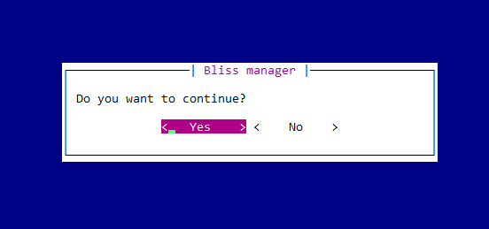
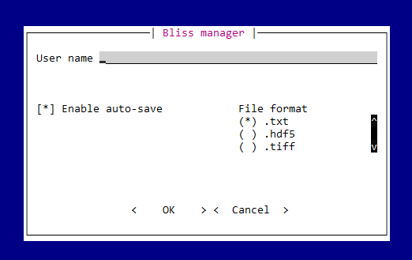
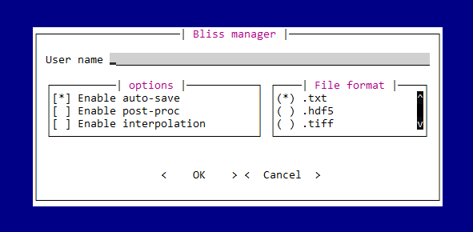
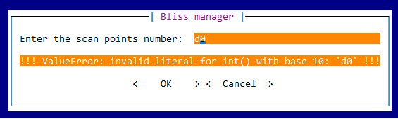
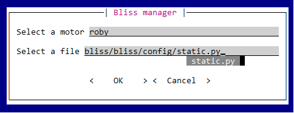

# Dialog with users

BLISS offers a variety of simple dialogs to interact with users, like messages, yes-no questions, inputs and more.


## The user dialog classes

All the dialogs are built on top of the _UserDlg base class.
The class describes all the information required to create a widget for any kind of backend (Prompt-toolkit, Qt, ...).
The default backend is Prompt-toolkit.


The predefined dialogs are: 

* `UserMsg( "This is a message" )`: display a message to the user.
* `UserYesNo( "Do you want to continue?" )`: asks a question, expecting a yes or a no answer.
* `UserInput( "What is your name?" )`: asks for a string input.
* `UserIntInput( "What is your age?" )`: asks for an integer input.
* `UserFloatInput( "What is the target position?" )`: asks for a float input.
* `UserFileInput( "Select a file" )`: asks for a file path input.
* `UserChoice( "Select one", choices )`: asks to select one value among a list of choices.
* `UserCheckBox( "option_name" )`: enable/disable an option.


All dialogs have the following attributes:

*  `label`:       the widget label 
*  `defval`:      the default value
*  `text_align`:  the label text alignment. Allowed are `["CENTER", "LEFT", "JUSTIFY", "RIGHT"]`
*  `text_expand`: enable label text to expand (True or False)

UserInput dialogs have these extra arguments:  

*  `validator`:   the validator function (optional)
*  `completer`:   the list of words for auto-completion (optional)

The UserChoice dialogs have a special argument:

*  `values`:      the list of choices. One choice is a pair (value, text). 

                  ex: values = [(1,"red"), (2,"blue"), (3,"green")] 

## Display the dialog on screen ( Prompt-toolkit backend )

### Message and question

Any user dialog can be transformed into a prompt toolkit widget and display on screen with the `display` function.
They `display` function is designed for a single dialog like `UserMsg` or `UserYesNo`.
In the case of a `UserYesNo` dialog, the `display` function returns the answer as a Boolean. 
 
```python
from bliss.shell.cli.user_dialog import UserMsg, UserYesNo
from bliss.shell.cli.pt_widgets import display

dlg = UserYesNo(label="Do you want to continue?")
display(dlg, title='Bliss manager')

dlg = UserMsg(label="This is a message")
display(dlg, title='Bliss manager')

>>> Out [17]: True
```




### Multiple inputs dialog

Multiple widgets dialog can be built with the `BlissDialog` object and display on screen with its `.show()` method.
The first argument of the `BlissDialog` object is a 2d list of user dialogs. 
The first dimension represent the vertical layout and the second dimension the horizontal layout.
The space between the widgets can be specified with the `padding` argument. 
After pressing the `ok` button, a dictionary with widget values will be returned. 
The dictionary is indexed by the dialog name (if not None) else by the dialog object itself.
If pressing the `cancel` button, it will return `False`.

```python
user_dlg_list = [   [dlg_x1_y1, dlg_x2_y1, ...], 
                    [dlg_x1_y2, dlg_x2_y2, ...], 
                    [dlg_x1_y3, dlg_x2_y3, ...],  ]  
                    
```

`BlissDialog(user_dlg_list,title="BlissDialog", paddings=(1, 1), show_help=False)`

```python
from bliss.shell.cli.user_dialog import UserInput, UserCheckBox, UserChoice
from bliss.shell.cli.pt_widgets import BlissDialog

dlg1 = UserInput(label="User name")
dlg2 = UserCheckBox(label="Enable auto-save", defval=True)
dlg3 = UserChoice(label="File format", values=[('txt','.txt'), ('hdf5','.hdf5'), ('tiff','.tiff')])

BlissDialog( [  [dlg1], [dlg2, dlg3]  ] , title='Bliss manager',paddings=(3,3)).show()

>>> Out [25]: ['', True, 'txt']
```



#### Container ( dialogs group ) 

A sub-set of dialogs can be grouped using the `Container` object:


`Container(user_dlg_list, title=None, border=0, padding=0, splitting="h")`

The `title` argument is a sub-title for the widget group (if `title=None`, the surrounding frame is not drawn).
The `border` argument is the space between the widgets group and the surrounding frame.
The `padding` argument is the space between the widgets of the group.
The `splitting` argument can be a `h` (horizontal) or a `v` (vertical) and describes the stacking orientation of the widgets.

```python
from bliss.shell.cli.user_dialog import Container

dlg1 = UserInput(label="User name")
dlg2 = UserCheckBox(label="Enable auto-save", defval=True)
dlg3 = UserCheckBox(label="Enable post-proc", defval=False)
dlg4 = UserCheckBox(label="Enable interpolation", defval=False)
dlg5 = UserChoice(values=[('txt','.txt'), ('hdf5','.hdf5'), ('tiff','.tiff')])

ct1 = Container( [dlg2, dlg3, dlg4], title="options" )
ct2 = Container( [dlg5,], title="File format" )

BlissDialog( [  [dlg1], [ ct1, ct2]  ] , title='Bliss manager').show()

>>> Out [74]: ['', True, False, False, 'txt']
```



#### UserInput validator

The `UserInput` object takes an optional `validator` argument. The `validator` argument must be an object of the type `Validator`.
The validator object takes as first argument a function instance and the function arguments as an extra arguments.
The validation function will be called when leaving the input field of the widget in order to check that the user input is corresponding to the expected type of answer.
The validation function must raise or produce an exception if the user input is not what expected. 

For example we can check that the user input is an integer or if it is included in a given range.


```python
from bliss.shell.cli.user_dialog import Validator

def is_int(str_input):
    return int(str_input)

def in_frange(str_input, mini, maxi):
    val = float(str_input)

    if val < mini:
        raise ValueError("value %s < %s (mini)" % (val, mini))

    if val > maxi:
        raise ValueError("value %s > %s (maxi)" % (val, maxi))

    return val

v1 = Validator(is_int)
v2 = Validator(in_frange, 5, 10)

dlg1 = UserInput(label="Enter the scan points number: ", validator=v1)
dlg2 = UserInput(label="Enter a number in range [5, 10]: ", validator=v2)

```

The `UserIntInput` and `UserFloatInput` are already defined and check if the user input is an integer or a float.



#### UserInput completer

The `UserInput` object takes an optional `completer` argument. The `completer` argument must be a list of strings which will be used as a completion list when the user is typing.
For file path completion, there already exists a `UserFileInput` object which implements a special path completer. 

```python
from bliss.shell.cli.user_dialog import UserInput, UserFileInput
from bliss.common.utils import get_axes_names_iter

motor_names = list(get_axes_names_iter())
dlg1 = UserInput(label="Select a motor", completer=motor_names)
dlg2 = UserFileInput(label="Select a file")

BlissDialog( [  [dlg1], [dlg2,]  ] , title='Bliss manager').show()

>>> Out [7]: ['roby', 'bliss/bliss/config/static.py']
```




#### Wizard dialog

The BlissWizard object takes a list of BlissDialog objects and display them one by one.
It is useful when there are too many widgets for a single page/screen.
It returns the list of the results of each page.


```python
from bliss.shell.cli.user_dialog import BlissWizard

bdg1 = BlissDialog( ... )
bdg2 = BlissDialog( ... )

BlissWizard([bdg1, bdg2]).show()

```
