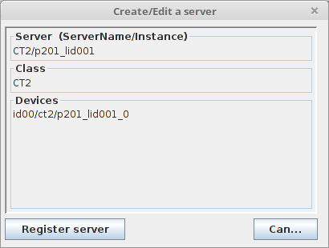
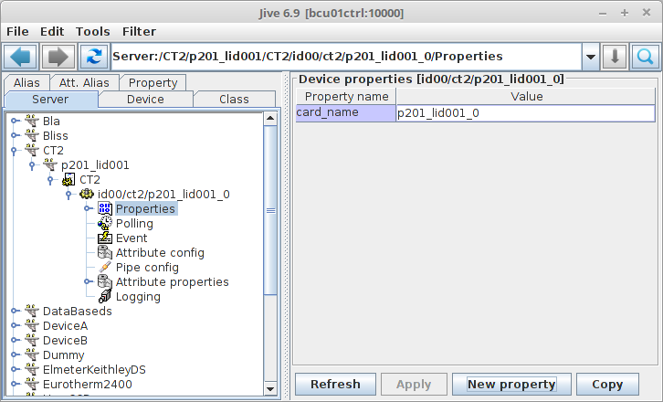
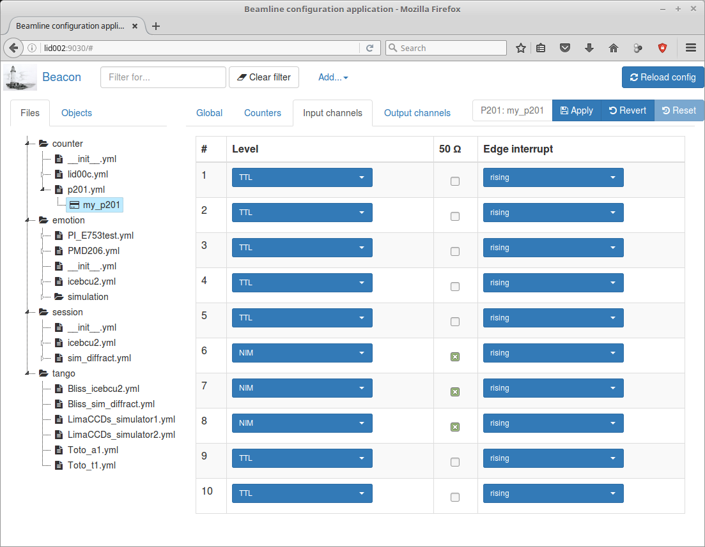

.. currentmodule: bliss.controllers.ct2

.. _bliss-ct2-how-to:

Bliss CT2(P201/C208) how to
===========================

This chapter assumes you have have a running a bliss configuration server
(beacon) available on your system.

The CT2 card has two models:

* *P201*: the :term:`PCI` version of the card

  * 8 input channels
  * 2 input/output channels

* *C208*: the :term:`cPCI` version of the card

  * 10 input channels
  * 2 input/output channels

.. important::
    The CT2 bliss software has only been tested in a limited environment:

    * **one** card.
    * Only the *P201* has been fully tested (*C208* not tested).

    Please contact the bliss development team if any of these missing
    features is blocking for you.

.. _bliss-ct2-driver-how-to:

Driver installation
-------------------

The driver is available as an external project. If you are at ESRF_ you
can install it with blissinstaller tool.

For reference, here is a link to the
`CT2 driver project on gitlab <http://gitlab.esrf.fr/Hardware/P201>`_.

Configuration
-------------

There are three possibilities to configure a CT2 card, depending on what you
want to achieve.

.. _bliss-ct2-bliss-config:

1. Remote configuration
~~~~~~~~~~~~~~~~~~~~~~~

This is probably the most interesting configuration: a zerorpc server running
on the PC where the card is installed which talks directly with the linux driver
of the card:

.. graphviz::

   digraph G {
     rankdir="LR";

     driver [label="driver", shape="box"];
     card [label="Card", shape="component"];

     subgraph cluster_zerorpc {
       label = "CT2 zerorpc server";
       color = black;
       node [shape=rectangle];

       CT2_Device [label="bliss\ndevice.CT2"];

     }

     subgraph cluster_client {
       label = "bliss shell";
       node [shape=rectangle];

       CT2_Client [label="bliss\nclient.CT2"];
     }

     driver -> card [dir="both", label="PCI bus"];
     CT2_Device -> driver[dir=both];
     CT2_Client -> CT2_Device [dir="both", label="zerorpc\nreq/rep & stream"];
   }

First, you need run :program:`bliss-ct2-server` on the PC where the card is
installed by typing:

.. code-block:: bash

   $ bliss-ct2-server
   INFO 2017-10-30 15:14:57,680 CardInterface(/dev/ct2_0): connecting to /dev/ct2_0
   INFO 2017-10-30 15:14:57,684 CT2Server: Serving CT2 on tcp://0.0.0.0:8909...

By default it runs on port **8909**. To run in a different options type
argument ``bliss-ct2-server --help``.

Second, the YAML_ configuration:

.. code-block:: yaml

   plugin: ct2
   class: CT2
   name: p201_remote
   address: tcp://lid312:8909

(replace the address with the one that makes sence to you)

Finally, the remote card is seen on bliss *almost* transparently as if it
was a local card::

    from bliss.config.static import get_config

    config = get_config()
    p201 = config.get('p201_remote')

.. _bliss-ct2-tango-spec-config:

2. Spec & TANGO_ configuration
~~~~~~~~~~~~~~~~~~~~~~~~~~~~~~

Bliss provides a TANGO_ server and a set of spec macros in case you need to
control the card through Spec:

.. graphviz::

   digraph G {
     rankdir="LR";
     node [shape="box"];

     driver [label="driver"];
     card [label="Card", shape="component"];
     bliss [label="bliss shell"];
     zerorpc [label="CT2 zerorpc server"];
     tango [label="CT2 TANGO server"];
     spec  [label="Spec"];

     driver -> card [dir="both"];
     zerorpc -> driver [dir=both];
     tango -> zerorpc [dir="both"];
     spec -> tango [dir="both"];
     bliss -> zerorpc [dir="both"];
   }

First you need to have a running ``bliss-ct2-server``. See
:ref:`bliss-ct2-bliss-config` to find out how to do it.

.. _bliss-ct2-tango-config:

TANGO configuration
^^^^^^^^^^^^^^^^^^^

After, you need to configure a CT2 TANGO_ server. In Jive just go to the menu
bar, select :menuselection:`Edit --> Create server` and type in the following:

You should replace *p201_lid001_0* with a name at your choosing.

The final step in configuring the server is to add a property called
*card_name*. Its value should be the name of the object you gave in the YAML_
configuration:

.. _bliss-ct2-spec-config:

SPEC configuration
^^^^^^^^^^^^^^^^^^

bliss also provides a *ct2.mac* macro counter/timer so it can be used from spec.

To configure the CT2 you need to have previously configured TANGO_ CT2 device
(see :ref:`bliss-ct2-tango-config`).

Don't forget to add in setup *need ct2*.

Enter **config** and in the *Motor and Counter Device Configuration (Not CAMAC)*
screen, in the SCALERS list add a new item so it looks like this::

    SCALERS        DEVICE                    ADDR  <>MODE  NUM                 <>TYPE
        YES           ct2  id00/ct2/p201_lid001_0           11    Macro Counter/Timer

After, in the *Scaler (Counter) Configuration* screen, add the counters and/or
timer (don't forget that the *Unit* is the nth-1 device in the list of Macro
Counter or Macro Counter/Timer on the previous screen).

If you add a CT2 timer, the *Chan* must be **0**. The CT2 timer is capable of
working in 6 different frequencies: 1.25 KHz, 10 KHz, 125 KHz, 1 MHz, 12.5 MHz
and 100 MHz. The spec *Scale Factor* selects this frequency. The standard
working frequency is 1 MHz which correspondes to a *Scale Factor* of 1E6.
Example::

    Scaler (Counter) Configuration

    Number        Name  Mnemonic  <>Device  Unit  Chan   <>Use As  Scale Factor
         0     Seconds       sec   MAC_CNT     0     0   timebase       1000000
         1      p201_3    p201_3   MAC_CNT     0     3    counter             1

.. _bliss-ct2-local-config:

3. Local configuration
~~~~~~~~~~~~~~~~~~~~~~

No server required; only accessible on the PC the card is physically
installed. Useful for a standalone installation or debugging directly on
the PC where the card is installed.

You can work directly with the card without beacon::

    from bliss.controllers.ct2.card import P201Card, CardInterface
    from bliss.controllers.ct2.device import CT2

    iface = CardInterface('/dev/ct2_0')
    p201_card = P201Card(iface)
    p201_card.request_exclusive_access()
    p201_card.reset_software()

    p201 = CT2(p201_card)

...or with the following beacon configuration:

.. code-block:: yaml

   plugin: ct2
   class: CT2
   name: p201_local
   address: /dev/ct2_0

like this::

    from bliss.config.static import get_config

    config = get_config()
    p201 = config.get('p201_local')

Supported acquisition types
---------------------------

Here is a brief summary of the current acquisition types supported by the CT2:

Point period
    The time which corresponds to acquisition of one single point.
    This period is sub-divided in exposure time and a dead time.

Exposure time
    The time during which the input channels are enabled to count

.. the following diagrams need wavedrom sphinx extension
.. I used a WYSIWYG editor: www.wavedrom.com/editor.html

.. rubric:: Internal Trigger Single

.. wavedrom::
    {
      signal: [
        { node: "..a...........................b", period: 0.5 },
        { name: "soft. start",
          wave: "l.Pd.", period: 0.5 },
        { name: "out. gate",
          wave: "l.H....l.h....l.h....l.h....l.d.", period: 0.5, },
        { node: "..e....f", period: 0.5},
        { node: "..c......d", period: 0.5},
      ],

      edge: [ "a<->b Nb. points (N) = 4;",
              "c<->d Point period", "e<->f Exp. time" ],

      head: {
        text: "Internal Trigger Single",
        tick:-1,
      },

      foot: {
        text: "1 soft. start; 0 soft. triggers",
      }
    }

.. pull-quote::
    Start by software. Trigger by internal clock. Internal clock determines
    exposure time (constant) and point period (constant).

    Note that in this mode, the acquisition finishes after the last
    *point period*, where in non *single* modes it ends right after *exposure
    time* ends.

.. rubric:: Internal Trigger Multi

.. wavedrom::
    {
      signal: [
        { node: "..a.........................b", period: 0.5 },
        { name: "soft. start",
          wave: "l.Pd.", period: 0.5 },
        { name: "soft. trigger",
         wave: "l........Pl..Pl.......Pd.", period: 0.5 },
        { name: "out. gate",
          wave: "l.H...l..H...lH...l.....H...l", period: 0.5 },
        { node: "..c...d", period: 0.5 },
      ],

      edge: [ "a<->b Nb. points (N) = 4",
              "c<->d Exp. time" ],

      head: {
        text: "Internal Trigger Multi",
        tick:-1,
      },

      foot:{
        text: "1 soft. start; N-1 soft. triggers",
      },
    }

.. pull-quote::
    Start by software. Hardware takes one single point. Each point is
    triggered by software. Internal clock determines exposure time (constant).

.. rubric:: Internal Trigger Readout

.. wavedrom::
    {
      signal: [
        { node: "..a...........................b", period: 0.5 },
        { name: "soft. start",
          wave: "l.Pd.", period: 0.5 },
        { name: "out. gate",
          wave: "l.H......H......H......H......l", period: 0.5 },
        { node: "..c......d", period: 0.5 },
      ],

      edge: [ "a<->b Nb. points (N) = 4",
              "c<->d Exp. time" ],

      head: {
        text: "Internal Trigger Readout",
        tick:-1,
      },

      foot:{
        text: "1 soft. start; 0 soft. triggers",
      },
    }

.. pull-quote::
    Start by software. Trigger by internal clock which determines exposure time.
    Trigger ends previous acquisition and starts the next with no dead time.

    This mode is similar to *Internal Trigger Single* when *point period*
    equals *exposure time* (ie, no dead time).

.. rubric:: Software Trigger Readout

.. wavedrom::
    {
      signal: [
        { node: "..a...........................b", period: 0.5 },
        { name: "soft. start",
          wave: "l.Pd.", period: 0.5 },
        { name: "soft. trigger",
         wave: "l.........Pl..Pl........Pl.Pd.", period: 0.5 },
        { name: "out. gate",
          wave: "l.H.......H....H..........H...L", period: 0.5 },
      ],

      edge: [ "a<->b Nb. points (N) = 4"],

      head: {
        text: "Software Trigger Readout",
        tick:-1,
      },

      foot:{
        text: "1 soft. start; N soft. triggers",
      },
    }

.. pull-quote::
    Start by software; trigger by software. Trigger ends previous acquisition
    and starts next with no dead time. Exposure time determined by trigger.

.. rubric:: External Trigger Single

.. wavedrom::
    {
      signal: [
        { node: "..a...........................b", period: 0.5 },
        { name: "ext. trigger",
          wave: "l.Pd.", period: 0.5 },
        { name: "out. gate",
          wave: "l.H....l.h....l.h....l.h....l.d.", period: 0.5, },
        { node: "..e....f", period: 0.5},
        { node: "..c......d", period: 0.5},
      ],

      edge: [ "a<->b Nb. points (N) = 4;",
              "c<->d Point period", "e<->f Exp. time" ],

      head: {
        text: "External Trigger Single",
        tick:-1,
      },

      foot: {
        text: "1 ext. trigger start",
      }
    }

.. pull-quote::
    Start by external trigger. Trigger by internal clock.
    Internal clock determines exposure time (constant) and point period (constant).

    Note that in this mode, the acquisition finishes after the last
    *point period*, where in non *single* modes it ends right after *exposure
    time* ends.

    This mode is similar to *Internal Trigger Single* except that the start
    is done by an external trigger instead of software.

.. rubric:: External Trigger Multi

.. wavedrom::
    {
      signal: [
        { node: "..a..........................b", period: 0.5 },
        { name: "ext. trigger",
          wave: "l.Pl....Pl..Pl........Pd.", period: 0.5 },
        { name: "out. gate",
          wave: "l.H...l..H...lH...l......H...l", period: 0.5 },
        { node: "..c...d", period: 0.5 },
      ],

      edge: [ "a<->b Nb. points (N) = 4",
              "c<->d Exp. time" ],

      head: {
        text: "External Trigger Multi",
        tick:-1,
      },

      foot:{
        text: "N ext. triggers",
      },
    }

.. pull-quote::
    Start by external trigger. Trigger by external trigger.
    Internal clock determines exposure time (constant).

    This mode is similar to Internal Trigger Multi except that the start and
    the triggers are by an external trigger instead of software start and
    software trigger.

.. TODO document what happens if an external trigger arrives before the exposure time is finished

.. rubric:: External gate

.. wavedrom::
    {
      signal: [
        { node: "..a...........................b", period: 0.5 },
        { name: "ext. gate",
          wave: "l.H....L...H...LH.L.....H.....L", period: 0.5 },
        { name: "out. gate",
          wave: "l.H....L...H...LH.L.....H.....L", period: 0.5 },
      ],

      edge: [ "a<->b Nb. points (N) = 4" ],

      head: {
        text: "External gate",
        tick:-1,
      },

      foot:{
        text: "N ext. gates",
      },
    }

.. pull-quote::
    Start by external trigger. Exposure time determined by input gate signal.

.. rubric:: External Trigger Readout

.. wavedrom::
    {
      signal: [
        { node: "..a...........................b", period: 0.5 },
        { name: "ext. trigger",
         wave: "l.Pl.....Pl..Pl........Pl.Pd.", period: 0.5 },
        { name: "out. gate",
          wave: "l.H.......H....H..........H...L", period: 0.5 },
      ],

      edge: [ "a<->b Nb. points (N) = 4"],

      head: {
        text: "External Trigger Readout",
        tick:-1,
      },

      foot:{
        text: "N+1 ext. triggers",
      },
    }

.. pull-quote::
    Start by external trigger. Trigger by external trigger.
    Trigger ends previous acquisition and starts next with no dead time.
    Exposure time determined by trigger.

    This mode is similar to Internal Trigger Readout except that the start and
    the triggers are by an external trigger instead of software start and
    software trigger.

.. _bliss-ct2-yaml:
    
YAML_ specification
-------------------

Minimalistic configuration example:

.. code-block:: yaml

   plugin: ct2                   (1)
   name: p201                    (2)
   class: CT2                    (3)
   address: tcp://lid312:8909    (4)

Then, the web will provide you with a more user friendly page:

More complete example including channel configuration and
external trigger/gate:

.. code-block:: yaml

   plugin: ct2                    (1)
   name: p201                     (2)
   class: CT2                     (3)
   address: tcp://lid312:8909     (4)
   type: P201                     (5)
   clock: CLK_100_MHz             (6)
   external sync:                 (7)
     input:                       (8)
       channel: 7                 (9)
       polarity inverted: False  (10)
     output:                     (11)
       channel: 10               (12)
       mode: gate                (13)
   channels:                     (14)
   - address: 1                  (15)
     counter name: pC1           (16)
     level: NIM                  (17)
   - address: 10
     level: NIM                  (18)

#. plugin name (mandatory: ct2)
#. controller name (mandatory)
#. plugin class (mandatory)
#. card address (mandatory). Use `/dev/ct_<card_nb>` for a local card or
   `tcp://<host>:<port>` to connect to a remote zerorpc CT2 server.
#. card type (optional, default: P201). Valid values are P201, C208
#. card clock (optional, default: CLK_100_MHz)
#. External synchronization signal configuration
#. Input signal: used for external trigger/gate (optional, default: no input)
#. Input signal channel (mandatory if input keyword is given).
   Valid: P201: [1, 10]; C208: [1,12]
#. Interpret input signal polarity inverted (optional, default: False)
#. Output signal: used for output gate signal
#. Output signal channel (mandatory if ouput keyword is given).
   Valid: P201: [9, 10]; C208: [11,12]
#. Output signal mode (optional, default: gate).
   Only possible value today is gate
#. Channel configuration
#. channel address (mandatory). Valid: P201: [1, 10]; C208: [1, 12]
#. counter name (optional). Needed if want to count on this channel.
#. channel input level (optional, default: TTL)
#. channel input/output level (optional, default: TTL)

.. note::

   if external sync input/output channel is given, the channel counter name
   is ignored as this channel cannot be used to count

.. note::

   If a zerorpc *address* is set, the *type* is ignored. In this case it is
   specified at the zerorpc server command line.
