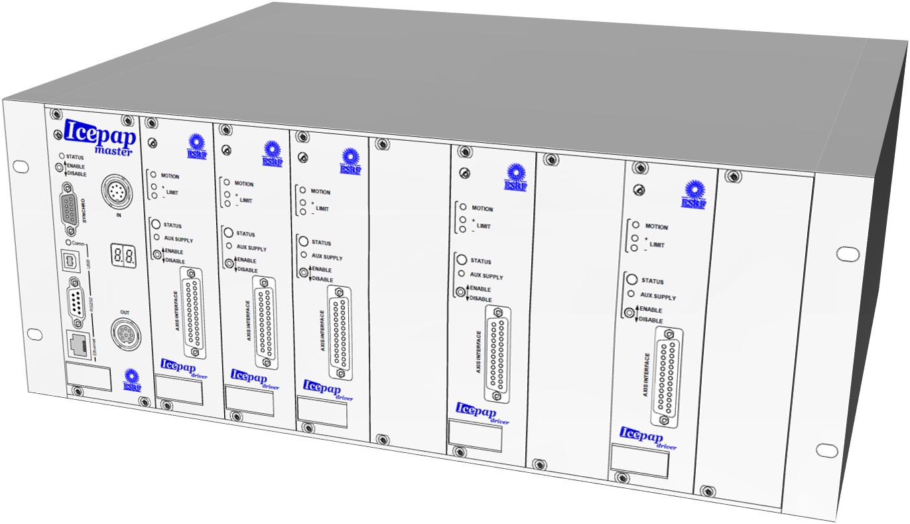

.. currentmodule: bliss.controllers.emulator

.. _bliss-emulator-how-to:

Bliss emulator how to
=====================

This chapter assumes you have have a running a bliss configuration server
(beacon) available on your system.

Quick start
-----------

To create a server use the following configuration as a starting point:

.. code-block:: yaml

    name: my_emulator
    devices:
      - class: SCPI
        transports:
          - type: tcp
            url: :25000

To start the server you can do something like::

    $ python -m bliss.controllers.emulator my_emulator

bliss also provides a ``bliss-emulator`` script which is exactly the same:

    $ bliss-emulator my_emulator

.. hint:: add ``--help`` to see which options are available. ``--log-level``
   can be very useful to find which serial lines are being activated
   (see :ref:`bliss-emulator-serial-configuration`)

In this example, since a TCP transport is configured, a simple *netcat* client
can be used to connect to the instrument::

    $ nc 0 25000
    *idn?
    Bliss Team, Generic SCPI Device, 0, 0.1.0

.. _bliss-emulator-configuration:

YAML_ configuration
-------------------

The emulator server configuration demands a unique *name* and optional devices
(although it is only useful *with* devices).

It is easier to start with a full example:

.. code-block:: yaml

    name: my_emulator          # (1)
    backdoor: :5100            # (2)
    devices:                   # (3)
      - class: IcePAP          # (4)
        newline: #xA           # (5)
        module: icepap         # (6)
        transports:            # (7)
          - type: tcp          # (8)
            url: :5000         # (9)
            newline: #xA       # (10)
          - type: serial       # (11)
            url: /tmp/pts/ice1 # (12)
            baudrate: 9600     # (13)
        axes:                  # (14)
          - address: 1
          - address: 2
            axis_name: th
            low_limit: -10000
            high_limit: 10000
          - address: 4

Details:

#. server name (mandatory and unique)
#. interactive gevent network console listener port (optional)
   (see :ref:`bliss-emulator-backdoor-configuration`)
#. list of devices (as many as you want)
#. emulator device class name (mandatory) (check for available classes in
   `bliss.controllers.emulators`)
#. device new-line (optional, default='\\n'). Overrides default device
   newline charater
#. emulator module name. The name of the python file (without .py extension)
   in `bliss.controllers.emulators` (mandatory if
   `class_name.lower() != module_name` so, in this example it would not be
   necessary) [#mod_fnote]_
#. list of transports (as many as you want)
#. transport type (mandatory. available: *tcp*, *serial*)
#. transport url (mandatory for tcp)
   (see :ref:`bliss-emulator-tcp-configuration`)
#. transpoort new-line (optional, default=device new-line character). Overrides
   device newline charater
#. serial line transport (see :ref:`bliss-emulator-serial-configuration`)
#. serial line url
#. emulate baudrate delay (optional, default: None, means max speed)
#. device specific configuration

.. [#mod_fnote] If you are using a third party emulator available in
   `foo.bar.emulator` python package, instead of *module* key (which refers
   to path relative to `bliss.controllers.emulators`), you need to use *package*
   key like this: ``package: foo.bar.my_emulator``

.. _bliss-emulator-transport-configuration:

Transport
#########

.. _bliss-emulator-tcp-configuration:

TCP
~~~

In case you use TCP transport the supported *url*\s are the same as
the the listener argument for the :class:`~gevent.server.StreamServer`.
Examples:

.. code-block:: yaml

  url: :5100            # listen on port 5100, accept connections from anywhere
  url: 0:5100           # same as above
  url: ['', 5100]       # same as above
  url: ['0', 5100]      # same as above

  url: localhost:5100      # listen on port 5100, accept only local connections
  url: [localhost, 5100]   # same as above
  url: ['localhost', 5100] # same as above

.. _bliss-emulator-serial-configuration:

Serial line
~~~~~~~~~~~

Serial line transport only needs: ``type: serial`` to be configured.
It uses a pseudo-terminal to emulate serial line. The mandatory parameter *url*
must be an absolute path in the filesystem from which the serial line should
be addressed. Internally, the server will create a symbolic link from
`/dev/pts/<N>` to the url you specified.

.. _bliss-emulator-backdoor-configuration:

Backdoor
########

The emulator backdoor will be activated if the *backdoor* key is specified.
The supported values for the backdoor key are exactly the same as for the
*url* key in the TCP transport (see
:ref:`bliss-emulator-transport-configuration`).

Example:

.. code-block:: yaml

   name: my_emulator
   # listen to port 5100, accept connection from anywhere
   backdoor: :5100
   devices:
     - class: IcePAP
       transports:
         - type: tcp
           url: :5000

If defined, you are able to connect to the server's backdoor with::

  $ nc 0 5100
  Welcome to Bliss emulator server console.
  My name is 'my_emulator'. You can access me through the 'server()' \
  function. Have fun!

  >>> s = server()
  >>> type(s)
  <class 'bliss.controllers.emulator.Server'>
  >>> s.devices          # dict<BaseDevice: list<Transport>

.. _bliss-emulator-icepap-configuration:

IcePAP_ device
##############

For reference, the IcePAP_ emulator device code:
:mod:`~bliss.controllers.emulators.icepap`.

IcePAP_ configuration is straight forward. The only mandatory key
is ``class: IcePAP``. *module* key is optional. In case you decide to add it,
it must be ``module: icepap``.

Any parameter supported by IcePAP_ at the system level and axis level is
supported. At startup, the IcePAP_ emulator will be initialized with any
parameter specified in the configuration.

An additional optional key ``axes`` allows to initialize only specific axes.
If not given, the IcePAP_ emulator will be initialized with all 128 axes.

Example:

.. code-block:: yaml

  name: my_emulator
  devices:
    - class: IcePAP           # (1)
      transports:
        - type: tcp
          url: :5000

    - class: IcePAP           # (2)
      module: icepap
      ver: 3.18.1             # (3)
      transports:
        - type: tcp
          url: :5001
        - type: serial
	  url: /tmp/pts/ice1
	  baudrate: 9600
      axes:                   # (4)
        - address: 1          # (5)
        - address: 2          # (6)
          axis_name: th       # (7)
          low_limit: -10000
          high_limit: 10000
        - address: 4

#. Minimalistic configuration of IcePAP_ listening on port 5000
#. More complete configuration
#. Example to set a specific firmware version with *ver* parameter
#. Specify a concrete list of axes
#. Add axis *1* with default axis configuration
#. Add axis *2* with specific configuration
#. name axis *2* as *th* (note that key *name* cannot be used since
   it will be interpreted by bliss. *axis_name* will correspond to the ``NAME``
   command)

.. _bliss-emulator-new-device-how-to:

Develop a new emulator device
-----------------------------

It is quite simple to write a new device which mimics a new hardware if
the hardware communicates through ethernet or serial line and the communication
protocol is available.

The following example explains how to start writing a very simplistic emulator
for the CAENels_ AH501D_ picoammeter (documentation
`here <http://www.caenels.com/wp-content/uploads/2015/04/AH501D_UsersManual_V1.7.pdf>`_). It serves the purpose of demonstrating how to use the emulator API
to start writing an emulator device. After, you are completely free to use your
python skills to implement your device logic as you see more suitable.

We choose this hardware as an example because the API is simple (a few commands
only) and the documentation is freely available on-line.

Let's start by creating a new python file under
:mod:`bliss.controllers.emulators` called *ah501d.py*. In there you just need
to write a device class that inherits from
:class:`~bliss.controllers.emulator.BaseDevice` and override the
:meth:`~bliss.controllers.emulator.BaseDevice.handle_line` method.

Our first version will just echo back the command sent by the client.
This is what is tipically called the *echo server*. It is the network version
of the *Hello, world!* program. Not very interesting but it is enough to get
us started::

    # -*- coding: utf-8 -*-

    # Dont forget to add a header

    """AH501D: dont forget to document"""

    from bliss.controllers.emulator import BaseDevice

    class AH501D(BaseDevice):
        """The AH501D Bliss emulator device"""

        DEFAULT_NEWLINE='\n'

        def handle_line(self, line):
	    self._log.debug('received: %r', line)

            # throw it back to the client
	    result = line

	    self._log.debug('answering with: %r', result)
            return result

You may notice that we configured the newline to `\\n` when, in reality
the AH501D expects `\\r`. We only do this during development because
it makes our life easier to use *netcat* (see below).

Now we simple configure our emulator in a YAML_ file accessible to beacon:

.. code-block:: yaml

    name: my_emulator
    devices:
      - class: AH501D
        module: ah501d
        transports:
          - type: tcp
            url: :10001

We start our emulator with::

    $ python -m bliss.controllers.emulator --log-level=DEBUG my_emulator

...and we test it with netcat::

    $ nc -C 0 10001
    BDR ? <hit return>
    BDR ?
    Hello <hit return>
    Hello

Good! Our server is now running... but it doesn't gives the answers we were
looking for.
As an example, lets try to implement ``BDR`` (baudrate) command (for the sake
of brevity, the code snippets will focus on the added/modified code only)::

    #: Baudrate command default value
    BDR = '921600'

    def handle_line(self, line):
        self._log.debug('received: %r', line)

	line = line.strip()
        pars = line.split()
        cmd = pars[0].upper()

	if pars[-1] == '?':  # get parameter
            value = getattr(self, cmd)
            result = '{0} {1}'.format(cmd, value)
        else:                # set parameter
            setattr(self, cmd, pars[1])
            result = 'ACK'
	result += '\r\n'

	self._log.debug('answering with: %r', result)
        return result

Restart the server. Testing it with *netcat* will give something like::

    $ nc -C 0 10001
    BDR ?         <hit return>
    BDR 921600
    BDR 9600      <hit return>
    ACK
    BDR ?         <hit return>
    BDR 9600

Cool! Now try to type another command (ex: ``BIN ?``). Your netcat just exited!
And if you look at your server output you will see a traceback. Not very nice,
is it? The real instrument will probably just answer with ``NAK\r\n``.
Lets try to do the same by moving all code to an auxiliary function
``__handle_line()`` and have ``handle_line()`` call it in a protected way::

    def handle_line(self, line):
        try:
            return self.__handle_line(line)
        except:
	    self._log.error('Unrecognized command: %r', line)
            return 'NAK\r\n'

    def __handle_line(self, line):
        self._log.debug('received: %r', line)

        line = line.strip()
        pars = line.split()
        cmd = pars[0].upper()

	if pars[-1] == '?':  # get parameter
            value = getattr(self, cmd)
            result = '{0} {1}'.format(cmd, value)
        else:                # set parameter
            setattr(self, cmd, pars[1])
            result = 'ACK'
	result += '\r\n'

	self._log.debug('answering with: %r', result)
	return result

::

    $ nc -C 0 10001
    BDR ?      <hit return>
    BDR 921600
    BIN ?      <hit return>
    NAK
    Hello      <hit return>
    NAK

There! Now your device looks more robust!

That's it for this how-to. The complete code can be downloaded :download:`here <_static/ah501d.py>`.
Next steps: Have a look at the code from existing bliss emulator devices
for some inspiration on how to implement your own device:

* :mod:`~bliss.controllers.emulators.pi`
* :mod:`~bliss.controllers.emulators.icepap`
* :mod:`~bliss.controllers.emulators.scpi`

.. hint:: :term:`SCPI` devices can inherit from
	  :class:`~bliss.controllers.emulators.scpi.SCPI` instead of
          directly from :class:`~bliss.controllers.emulator.BaseDevice`.
	  This helper already implements a parser for :term:`SCPI` commands so
	  you needn't worry about doing it yourself. The
	  :mod:`~bliss.controllers.emulators.scpi` module documentation
	  provides more detailed information
