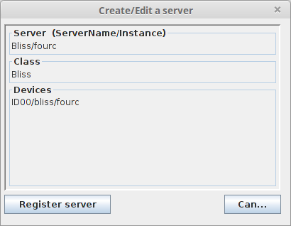
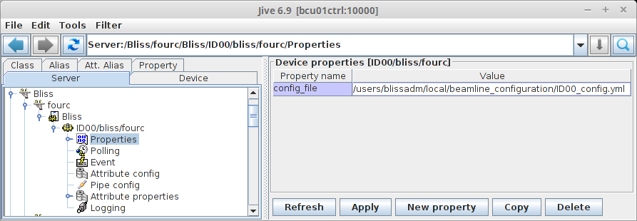

.. _bliss-how-tango:

How to setup a new Bliss TANGO_ server
======================================

Bliss project provides extensions that allow you to work with bliss
through TANGO_. This is used at the ESRF_, for example, to access bliss from
spec_.

This how-to assumes you have a running bliss configuration server.

A bliss TANGO_ server consists of at least a device of class *Bliss*.
It may or not be configured to provide additional access to bliss axes,
temperature or other supported devices.

Before you start you must know that bliss device reads its configuration
from a YAML_ file. It expects a bliss *session* like YAML_ file. Example:

.. code-block:: yaml

  fourc:
    setup-file: /users/blissadm/local/beamline_configuration/ID00_setup.py
    config_objects: [th, tth, chi, phi]

To configure a new Bliss server in Jive just go to the menu bar, select
:menuselection:`Edit --> Create server` and type in the following:

You should replace *fourc* with the name of your server and *ID00/bliss/fourc*
with the name of your bliss device (the name is a completely free TANGO_ device
name but we recommend following the notation:
*<beamline name>*/bliss/*<server name>*)

The YAML_ example above configures an optional setup file. It also exports
the *th*, *tth*, *chi* and *phi* objects. If these are bliss axes this means
that *BlissAxis* TANGO_ devices will be created automatically the next time
your bliss server starts.

All that remains now is to tell Bliss device where to find your YAML_ bliss
session configuration file. You can do this in Jive by adding a new property
called *config_file* to the bliss device you just created:

By default, the Bliss device will use the configuration from session name that
matches the server name (in our example: *fourc*). You can override the default
behavior by adding property called *session_name* with the name of the session
you want to use.

Next, you can run the server by typing on the command line::

    $ Bliss fourc

(replace *fourc* with the name of your server)
